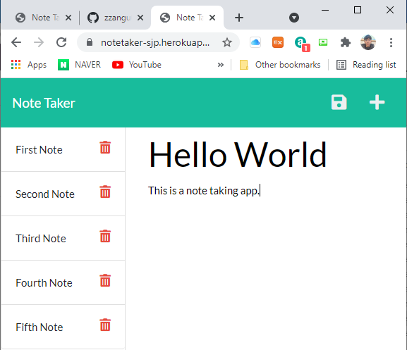

# Note Taker

## Table of Contents
- [**Description**](#-description)
- [**Features**](#-features)
- [**Installation**](#-installation)
- [**Usage**](#-usage)
- [**License**](#-license)
- [**Demo Video**](#-demo-video)
- [**Questions**](#-questions)
- [**Author**](#-author)

## 📑 Description
As a busy web developer, don't you need to have a note taking app for everything what you are currently thinking about?   
Visit my [**Note Taker App**](https://notetaker-sjp.herokuapp.com/) to jot down everything you want to!  

## ❗ Features
1. Add Notes! You can have up to 1,000,000 notes in my app!
2. View Notes from your click! You can go back to your notes and see what you put there!
3. Delete Notes! You put some wrong notes by mistake, just erase it!  
**Notes:** You cannot edit your note once you add it. Be careful before you upload the note!

The image below shows how the app looks like when you get to the **notes** page.  
**CLICK** the image and see how the routes are working!  

## 💾 Installation
Type and run following commands in your terminal.
- **`npm i express`**   

You already have **`express`** in your **`package.json`**?  
Then just type **`npm i`** in your terminal.

## 💻 Usage
For anyone who wants to take notes on the browser.  

Type and run following command in your terminal.
- **`node server.js`** 

## 🛠 License
This application is covered by the **ISC** license.

## 🎬 Demo Video
If you want to watch the demo video for how to use the application, check out the video below.  

**CLICK THE PLAY BUTTON**  

## ❔ Questions
🖐 If you have any question about me or my project, feel free to contact me!  
- **Github** Link: [**zzangu0215**](https://github.com/zzangu0215)  
- **Email**: **tajo0215@gmail.com**

## 😎 Author

- **Jun Park**
    - Portfolio: [**Portfolio**](https://zzangu0215.github.io/portfolio/) (to be updated)
    - Email: **tajo0215@gmail.com**
    - SNS: [**Instagram**](https://www.instagram.com/o0ojunny/)